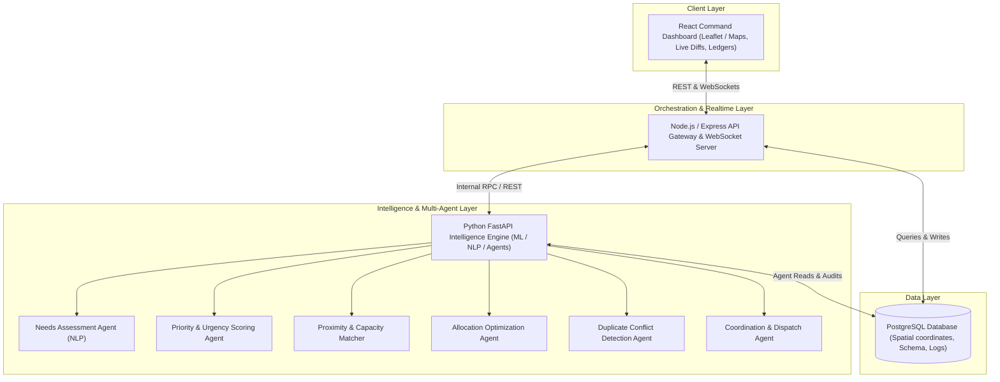

# RESQ — Agentic Disaster Relief & Emergency Resource Coordinator

[](#)
[](#)
[](#)

> **RESQ** is a multi-agent autonomous coordination operating system designed to manage emergency disaster relief operations. During sudden floods, earthquakes, or cyclones, RESQ ingests raw field SOS reports, assesses multi-resource requirements, scores urgency, matches nearest viable capacity across NGOs and government agencies, prevents duplicate dispatches, dynamically reallocates supplies upon critical escalations, and maintains an auditable, plain-English agent reasoning log.

---

## 📌 Problem Statement (PS20)

During crises, relief resources—food packets, emergency medical kits, shelter capacity, and search-and-rescue teams—must be deployed across distributed zones under incomplete, fast-changing conditions. Manual coordination between NGOs, armed forces, municipal bodies, and volunteers is notoriously fragmented, causing:
- **Redundant Dispatches (Duplicate Effort):** Multiple agencies sending identical supplies to the same zone while adjacent zones starve.
- **Static Bottlenecks:** No dynamic preemption or real-time re-routing when a nearby hospital collapses or water levels surge.
- **Lack of Transparency & Auditability:** No clear record of why specific allocation decisions were executed or why certain needs were held.

---

## 🌟 Key Differentiators & USPs

1. **Duplicate Effort & Conflict Detection Agent**:
   Cross-checks incoming and pending allocations across disparate agencies before dispatch. Eliminates over-saturation and redirects surplus resources to underserved zones.
2. **Dynamic Re-allocation Loop with Real-Time Visual Diffs**:
   When high-severity reports escalate in real time, the pipeline preempts low-priority assignments and reroutes en-route units, displaying a live **Before vs. After Allocation Diff** on the coordination dashboard.
3. **Scarcity Honesty & "On-Hold" Backlog**:
   Unlike systems that fake 100% resolution, RESQ explicitly flags deficits as `ON_HOLD` or `UNFULFILLED` with structured hold reasons (e.g., *"0 rescue boats available within viable range"*) to alert higher-level authorities.
4. **Explainable Agent Reasoning Trail**:
   Every decision generates an append-only, plain-English audit log explaining exactly why an action was taken.

---

## 🏗️ System Architecture



---

## 🤖 Multi-Agent Ecosystem

| Agent | Responsibility | Core Logic / Heuristics |
| :--- | :--- | :--- |
| **Needs Assessment Agent** | Ingests unstructured field reports and extracts structured resource vectors. | Parses casualties, damage severity, and requested supplies into `{food, medical, shelter, rescue_teams}`. |
| **Priority Scoring Agent** | Dynamically ranks disaster zones by human urgency. | $\text{Priority} = (\text{Severity} \times 0.4) + (\text{Population} \times 0.3) + (\text{Unmet Needs} \times 0.2) + (\text{Decay} \times 0.1)$ |
| **Proximity & Capacity Matcher** | Ranks eligible helping points without rigid radius walls. | $\text{Score} = \frac{\text{Available Stock} \times \text{Reliability}}{\text{Haversine Distance} + 1} \times \text{Arrangement Multiplier}$ |
| **Allocation Agent** | Matches optimal inventory batches to zone requirements. | Multi-resource greedy optimization; sets unfulfillable items to `ON_HOLD`. |
| **Duplicate Detection Agent** | Analyzes proposed shipments against active commitments. | Flags duplicate agency deliveries to the same zone; suggests automatic reroute or capacity caps. |
| **Coordination & Dispatch Agent** | Tracks mission lifecycle and agency acknowledgments. | Transitions state: `proposed` → `confirmed` → `en_route` → `delivered`. |

---

## 🛠️ Technology Stack

- **Frontend**:
  - React (Vite)
  - Leaflet / Mapbox GL (interactive radius rendering, coordinate pins, dispatch trajectory lines)
  - Lucide Icons & Tailwind / Vanilla CSS custom glassmorphic theme
  - Socket.io / WebSocket client for instant dashboard updates
- **Backend (Gateway & Coordination)**:
  - Node.js & Express
  - Socket.io for live event streaming (reallocation diffs, conflict banners)
  - PostgreSQL client (`pg` / Prisma / Knex)
- **Intelligence & Agent Service**:
  - Python 3.11 + FastAPI + Uvicorn
  - Pydantic models for structured agent payloads
  - NLP / ML parsing pipelines (Hugging Face / OpenAI / local lightweight embeddings)
  - NumPy / SciPy optimization heuristics
- **Database**:
  - PostgreSQL 15+ (Relational tables with coordinates, JSONB hints, and spatial indexing)
- **DevOps & Infrastructure**:
  - Docker & Docker Compose (multi-service container orchestration)

---

## 🗄️ Database Architecture

The system uses a relational PostgreSQL schema designed for high-throughput live updates:

- **`zones`**: Center coordinate `(lat, lng)`, affected `radius_m`, disaster type, severity score, and population estimate.
- **`helping_points`**: NGOs, government depots, and hospitals with coordinates `(lat, lng)`, reliability score, arrangement capability, and status.
- **`helping_point_inventory`**: Per-resource live tracking (`current_stock`, `max_capacity`, `replenish_rate`).
- **`zone_needs`**: Output of needs-assessment agent (`quantity_needed`, `quantity_fulfilled`, `fulfillment_status`).
- **`reports`**: Field reports with `(lat, lng)`, raw text, and requested supplies.
- **`allocations`**: Who helps whom, quantity, status (`proposed`, `confirmed`, `on_hold`, `en_route`, `delivered`), and `hold_reason`.
- **`duplicate_flags`**: Detected allocation collisions and resolution state.
- **`audit_log`**: Append-only log of every agent action with plain-English reasoning text.

> 📄 *Complete SQL definition available in [documentation/disaster_relief_schema.sql](documentation/disaster_relief_schema.sql).*

---

## 📁 Repository Structure

```text
RESQ-KurukuShetra/
├── docker-compose.yml              # Multi-container orchestration
├── README.md                       # Master project documentation
├── context.txt                     # Problem context and design notes
├── Final PS MIT.txt                # Official PS20 specifications
├── documentation/
│   ├── PRD.md                      # Product Requirement Document
│   └── disaster_relief_schema.sql  # Master PostgreSQL schema definition
├── frontend/                       # React dashboard application
│   ├── Dockerfile
│   ├── src/
│   │   ├── components/             # Map, AllocationLedger, DiffBanner, AuditFeed
│   │   └── services/               # API & WebSocket client
├── backend-node/                   # Node.js API Gateway & WebSocket Hub
│   ├── Dockerfile
│   ├── src/
│   │   ├── controllers/
│   │   ├── routes/
│   │   └── sockets/
└── backend-agents/                 # Python FastAPI Multi-Agent Service
    ├── Dockerfile
    ├── app/
    │   ├── agents/                 # Needs, Priority, Allocation, Conflict agents
    │   ├── models/                 # Pydantic schemas & DB interfaces
    │   └── main.py                 # FastAPI endpoints & agent router
```

---

## 🚀 Quickstart & Deployment (Docker)

Ensure **Docker** and **Docker Compose** are installed on your machine.

### 1. Clone & Navigate
```bash
git clone https://github.com/Ajinkya-909/RESQ-KurukuShetra.git
cd RESQ-KurukuShetra
```

### 2. Environment Configuration
Create a `.env` file in the root directory:
```env
POSTGRES_USER=resq_admin
POSTGRES_PASSWORD=resq_secret
POSTGRES_DB=resq_disaster_db
POSTGRES_PORT=5432

NODE_PORT=5000
FASTAPI_PORT=8000
FRONTEND_PORT=3000
```

### 3. Spin Up the Containers
```bash
docker-compose up --build
```

### 4. Access the Services
- **Command Dashboard (React)**: `http://localhost:3000`
- **Orchestration API (Node.js)**: `http://localhost:5000`
- **Agent Intelligence API (FastAPI Swagger)**: `http://localhost:8000/docs`
- **PostgreSQL Database**: `localhost:5432`

---

## 🎬 3-Minute Hackathon Demo Script

- **Act 1: Sandbox Initialization (0:00 - 1:00)**
  Launch the 10km × 10km sandbox with 4 affected zones (Flood, Earthquake) and 5 pre-seeded helping points (Red Cross, NDRF Depot, City Hospital). Trigger the initial pipeline: priorities are scored, nearest viable resources are matched, and supply vectors appear on the map.
- **Act 2: The Duplicate Conflict Interception (1:00 - 2:00)**
  Submit two field reports for Zone 2 requesting emergency rations. The **Duplicate Detection Agent** catches the duplicate shipment proposal before dispatch, caps the excess, and re-routes the surplus to underserved Zone 4.
- **Act 3: Critical Dynamic Re-allocation (2:00 - 3:00)**
  Spawn an unexpected Level-5 critical disaster event at Zone 5. The system automatically recalculates priorities, preempts an en-route rescue team from stable Zone 1, re-routes them to Zone 5, and highlights the **Visual Before/After Re-allocation Diff** and agent reasoning in the live audit feed.