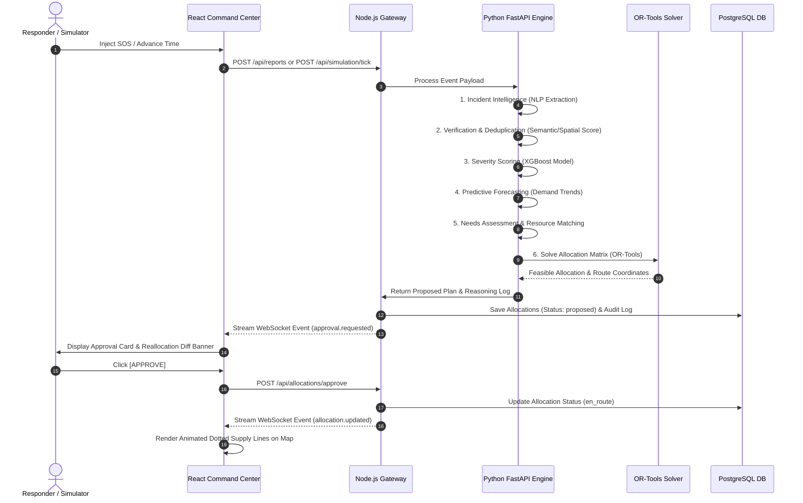

# Product Requirements Document (PRD): RESQ
## Predictive Multi-Agent Disaster Relief & Emergency Resource Coordinator
**Document Version:** Final 24-Hour Hackathon Standardized PRD  
**Status:** FROZEN FOR IMPLEMENTATION  
**Project Name:** RESQ  

---

## 1. Executive Summary & Vision

**RESQ** is a human-supervised, predictive multi-agent disaster response coordination platform and digital twin. It continuously ingests dynamic disaster information, verifies incoming reports, predicts future emergency demands, optimizes constrained resource allocations (using mathematical solvers rather than unstructured AI output), and dynamically replans response strategies as conditions change.

### The Core Operational Loop
$$\text{Observe} \rightarrow \text{Understand} \rightarrow \text{Verify} \rightarrow \text{Predict} \rightarrow \text{Prioritize} \rightarrow \text{Optimize} \rightarrow \text{Approve} \rightarrow \text{Act} \rightarrow \text{Simulate} \rightarrow \text{Replan}$$

Unlike static emergency dashboards or manual dispatch systems, RESQ provides:
1. **Macro & Micro Spatial Allocation:** Proactively allocates supplies to macro disaster zones (even without specific field reports) while remaining responsive to acute micro SOS field incidents (visualized as red dots).
2. **Constrained Mathematical Optimization:** Combines agentic reasoning (for state understanding and demand estimation) with hard constraint satisfaction solvers (Google OR-Tools) for resource allocation.
3. **Dynamic Reallocation & Anti-Thrashing:** Detects changing crisis levels or resource bottlenecks and reroutes aid only when the benefit exceeds switching overhead.
4. **Human-in-the-Loop Safety:** Operates with human approval for critical dispatch decisions, supported by complete transparency and auditability.

---

## 2. Problem Statement & Key Objectives

### Problem Statement
During major disasters, emergency operations centers deal with fragmented, duplicated, conflicting, and rapidly changing data while managing scarce relief resources (food, water, medical kits, rescue teams, shelter, ambulances). Traditional coordination relies on static spreadsheets and manual phone calls, causing delays, misallocation, and duplicate dispatch.

### Core Product Objectives
* **Unified Emergency Operations View:** Provide a real-time spatial map displaying macro disaster zones, micro SOS reports, helping points (NGOs, depots, bases), supply lines, and active allocations.
* **Proactive Zone Baseline Relief:** Ensure disaster zones receive baseline allocations based on population and severity, even if communication infrastructure prevents field reports.
* **Agentic Fact Extraction:** Parse unstructured natural-language SOS messages into validated JSON operational schemas.
* **Verification & Duplicate Detection:** Calculate multi-signal similarity scores to flag potential duplicate incidents and resolve conflicting field data without destroying raw evidence.
* **Machine Learning Severity & Demand Forecasting:** Predict zone severity scores and future resource demand curves (1-3 hours ahead).
* **Guaranteed Feasible Allocation:** Employ Google OR-Tools to solve multi-resource allocation under strict operational, capacity, and transport constraints.
* **Human-Supervised Control:** Require explicit approval for high-impact reallocations via actionable approval cards.
* **Deterministic Digital Twin Simulation:** Provide playback, time-step controls, and incident injection to test and demonstrate system responsiveness.

---

## 3. System Architecture & Entity Model

### 3.1 Data Model Topology

```mermaid
flowchart TD
    subgraph Supply Nodes ["Supply Nodes (Helping Points)"]
        HP1["NDRF Base Camp Alpha"]
        HP2["Red Cross Disaster Depot"]
        HP3["Municipal General Hospital"]
    end

    subgraph Intelligence Engine ["Multi-Agent & ML Engine"]
        Coordinator["Coordinator Agent"]
        NLP["Incident Intelligence Agent"]
        Verify["Verification Agent"]
        Severity["Severity Agent (XGBoost)"]
        Forecast["Prediction Agent (Chronos-2 / TimesFM)"]
        Needs["Needs Assessment Agent"]
        Resource["Resource Agent"]
        Solver["OR-Tools Optimization Engine"]
    end

    subgraph Demand Landscape ["Demand Landscape"]
        Z1["Macro Disaster Zone A (Radius: 2.5km)"]
        Z2["Macro Disaster Zone B (Radius: 1.8km)"]
        R1["Micro SOS Report #101 (Hospital Basement Flooded)"]
        R2["Micro SOS Report #102 (Trapped Family)"]
    end

    Supply Nodes -->|Inventory & Capabilities| Resource
    Demand Landscape -->|Raw Signals & Text| NLP & Verify
    NLP & Verify --> Severity & Forecast
    Severity & Forecast --> Needs
    Needs --> Solver
    Resource --> Solver
    Solver -->|Feasible Allocation Plan| Coordinator
    Coordinator -->|Action Approval Card| User["Human Disaster Coordinator"]
    User -->|Approve / Modify| Allocations["Allocations & Dotted Polyline Paths"]
    Allocations -->|Deploy Aid| Demand Landscape
```

### 3.2 Core Entities

1. **Disaster Zones (Macro Demand):**
   * Center coordinates `(lat, lng)`, `radius_m`, disaster type (e.g., flood, earthquake).
   * Population estimate, computed severity score ($0.0 - 1.0$), confidence score, aggregate resource needs.
   * Visualized as semi-transparent colored circular overlays (Red = Critical, Amber = Moderate, Green = Stabilizing).

2. **Field SOS Reports (Micro Incidents):**
   * Point coordinates `(lat, lng)`, raw description text, timestamp, source, extracted facts, severity signal, verification status.
   * Visualized as pulsing **Red Dots** at exact locations.

3. **Helping Points (Supply Nodes):**
   * Point coordinates `(lat, lng)`, agency type (`ngo`, `govt`, `private`), reliability score, arrangement capability score.
   * Inventory breakdown (current stock, max capacity, replenish rate).

4. **Allocations & Trajectories:**
   * Origin `point_id` to destination (`zone_id` or specific `report_id`).
   * Contains explicit `target_lat` and `target_lng` for UI dotted supply line rendering.
   * Status tracking (`proposed`, `confirmed`, `en_route`, `delivered`, `on_hold`, `cancelled`).

---

## 4. Multi-Agent & Machine Learning Pipeline



### 4.1 Detailed Agent Specifications

* **Coordinator Agent:** Manages workflow state, triggers execution paths, handles fallback routines, and presents approval requests.
* **Incident Intelligence Agent:** Parses raw text using structured JSON schema extraction.
  * *Example Extraction:* Input `"Basement flooded near Zone C, 40 patients stranded without power"` $\rightarrow$ `{ "incident_type": "flood", "zone": "Zone C", "stranded": 40, "medical_need": "critical", "road_status": "blocked" }`.
* **Verification Agent:** Evaluates duplicate candidates using composite scoring:
  $$\text{Duplicate Score} = w_1 \cdot \text{SemanticSim} + w_2 \cdot \text{LocationProximity} + w_3 \cdot \text{TimeProximity} + w_4 \cdot \text{EntityOverlap}$$
* **Severity Agent (ML Model):** Computes zone severity ($0.0 - 1.0$) using XGBoost trained on features including affected population, stranded count, water level, hospital capacity, and road status. (Rule-based fallback enabled if ML model is offline).
* **Prediction Agent:** Uses time-series forecasting (Chronos-2 / TimesFM or trend extrapolation) to predict resource demand 1-3 hours ahead (e.g., predicting hospital occupancy rising from $78\% \rightarrow 96\%$).
* **Needs Assessment Agent:** Converts severity and population figures into specific resource quantities (water L, food kg, medical kits, rescue teams).
* **Resource Agent:** Maps inventory across helping points, evaluates substitution possibilities (e.g., substituting general medical kits for specialized trauma packs), and flags supply bottlenecks.

### 4.2 Mathematical Optimization Engine (OR-Tools)

The system avoids using LLMs to make numerical allocation decisions. Instead, requirements are passed to Google OR-Tools.

* **Objective Function:**
  $$\max \left( \sum \text{Priority} \cdot \text{DemandSatisfied} + \text{CriticalCoverage} + \text{VulnerabilityScore} \right) - \min \left( \text{TravelCost} + \text{UnmetDemand} + \text{ReallocationPenalty} \right)$$
* **Constraints:**
  1. $\sum \text{AllocatedResource}_{i,j} \le \text{Inventory}_{i}$ (Capacity limits at Helping Point $i$)
  2. $\text{AllocatedResource}_{j} \le \text{Demand}_{j}$ (No over-allocation to Zone $j$)
  3. $\text{Accessibility}(i, j) = 1$ (Road segment must be passable)
  4. $\text{ReallocationBenefit} > \text{SwitchingCost} + \text{Threshold}$ (Anti-thrashing rule)

---

## 5. Technology Stack & Architecture

```text
+-----------------------------------------------------------------------+
|                         React Frontend                                |
|  - React.js / JSX             - Leaflet / OpenStreetMap               |
|  - Tailwind CSS               - Recharts Visualization                |
+-----------------------------------------------------------------------+
                                   |
                         (REST / WebSocket API)
                                   v
+-----------------------------------------------------------------------+
|                         Node.js Gateway                               |
|  - Express / Fastify Server   - WebSocket Broadcaster                 |
|  - Auth & Orchestration       - PostgreSQL Client                     |
+-----------------------------------------------------------------------+
                 |                                   |
        (PostgreSQL SQL)                           (REST / HTTP)
                 v                                   v
+-----------------------------------+   +-------------------------------+
|         PostgreSQL Database       |   | Python FastAPI Service        |
|  - Zones & Reports                |   | - LangGraph / State Machine   |
|  - Helping Points & Inventory     |   | - XGBoost Severity Model      |
|  - Allocations & Trajectories     |   | - Chronos-2 / Forecasting     |
|  - Audit Trail & Logs             |   | - Google OR-Tools Solver      |
+-----------------------------------+   +-------------------------------+
```

---

## 6. Database Schema Specification

The database utilizes PostgreSQL. Below is the complete SQL DDL schema aligned with the implementation specification:

```sql
-- Disaster Relief & Emergency Resource Coordinator Schema

CREATE TABLE resource_types (
    resource_id   SERIAL PRIMARY KEY,
    name          TEXT NOT NULL UNIQUE,        -- food, medical, shelter, rescue_team, water
    unit          TEXT NOT NULL                -- kg, kits, people, units
);

CREATE TABLE zones (
    zone_id             SERIAL PRIMARY KEY,
    name                TEXT NOT NULL,
    center_lat          DOUBLE PRECISION NOT NULL,
    center_lng          DOUBLE PRECISION NOT NULL,
    radius_m            DOUBLE PRECISION NOT NULL,
    disaster_type       TEXT NOT NULL,
    severity_score      DOUBLE PRECISION DEFAULT 0.0,
    severity_level      TEXT NOT NULL DEFAULT 'low' CHECK (severity_level IN ('low', 'moderate', 'high', 'critical')),
    confidence_score    DOUBLE PRECISION DEFAULT 1.0,
    population_estimate INTEGER DEFAULT 0,
    status              TEXT NOT NULL DEFAULT 'active' CHECK (status IN ('active','stabilizing','resolved')),
    created_at          TIMESTAMPTZ NOT NULL DEFAULT now(),
    updated_at          TIMESTAMPTZ NOT NULL DEFAULT now()
);

CREATE TABLE helping_points (
    point_id                SERIAL PRIMARY KEY,
    name                    TEXT NOT NULL,
    type                    TEXT NOT NULL CHECK (type IN ('ngo','govt','private')),
    lat                     DOUBLE PRECISION NOT NULL,
    lng                     DOUBLE PRECISION NOT NULL,
    reliability_score       DOUBLE PRECISION DEFAULT 1.0,
    arrangement_capability  DOUBLE PRECISION DEFAULT 0.0,
    status                  TEXT NOT NULL DEFAULT 'active' CHECK (status IN ('active','overwhelmed','offline')),
    created_at              TIMESTAMPTZ NOT NULL DEFAULT now()
);

CREATE TABLE helping_point_inventory (
    id              SERIAL PRIMARY KEY,
    point_id        INTEGER NOT NULL REFERENCES helping_points(point_id) ON DELETE CASCADE,
    resource_id     INTEGER NOT NULL REFERENCES resource_types(resource_id),
    current_stock   DOUBLE PRECISION NOT NULL DEFAULT 0,
    max_capacity    DOUBLE PRECISION NOT NULL DEFAULT 0,
    replenish_rate  DOUBLE PRECISION DEFAULT 0,
    UNIQUE (point_id, resource_id)
);

CREATE TABLE zone_needs (
    id                    SERIAL PRIMARY KEY,
    zone_id               INTEGER NOT NULL REFERENCES zones(zone_id) ON DELETE CASCADE,
    resource_id           INTEGER NOT NULL REFERENCES resource_types(resource_id),
    quantity_needed       DOUBLE PRECISION NOT NULL DEFAULT 0,
    quantity_fulfilled    DOUBLE PRECISION NOT NULL DEFAULT 0,
    fulfillment_status    TEXT NOT NULL DEFAULT 'shortage' CHECK (fulfillment_status IN ('shortage','balanced','surplus')),
    UNIQUE (zone_id, resource_id)
);

CREATE TABLE reports (
    report_id            SERIAL PRIMARY KEY,
    zone_id               INTEGER REFERENCES zones(zone_id),
    lat                   DOUBLE PRECISION NOT NULL,
    lng                   DOUBLE PRECISION NOT NULL,
    raw_text               TEXT NOT NULL,
    extracted_json         JSONB,
    severity_signal        DOUBLE PRECISION DEFAULT 0.5,
    verification_status    TEXT NOT NULL DEFAULT 'unverified' CHECK (verification_status IN ('unverified', 'verified', 'duplicate', 'rejected')),
    source                 TEXT NOT NULL DEFAULT 'field_report' CHECK (source IN ('initial_seed','field_report','agency_update')),
    created_at             TIMESTAMPTZ NOT NULL DEFAULT now()
);

CREATE TABLE allocations (
    allocation_id        SERIAL PRIMARY KEY,
    zone_id               INTEGER NOT NULL REFERENCES zones(zone_id),
    report_id             INTEGER REFERENCES reports(report_id) ON DELETE SET NULL,
    point_id              INTEGER NOT NULL REFERENCES helping_points(point_id),
    resource_id           INTEGER NOT NULL REFERENCES resource_types(resource_id),
    quantity               DOUBLE PRECISION NOT NULL,
    target_lat            DOUBLE PRECISION NOT NULL,
    target_lng            DOUBLE PRECISION NOT NULL,
    status                 TEXT NOT NULL DEFAULT 'proposed' CHECK (status IN ('proposed','confirmed','on_hold','unfulfilled','en_route','delivered','cancelled')),
    hold_reason             TEXT,
    eta                     TIMESTAMPTZ,
    exhaustion_estimate      TIMESTAMPTZ,
    created_at               TIMESTAMPTZ NOT NULL DEFAULT now(),
    updated_at                TIMESTAMPTZ NOT NULL DEFAULT now()
);

CREATE TABLE audit_log (
    log_id             SERIAL PRIMARY KEY,
    event_type          TEXT NOT NULL,
    agent_name          TEXT NOT NULL,
    zone_id               INTEGER REFERENCES zones(zone_id),
    point_id              INTEGER REFERENCES helping_points(point_id),
    allocation_id          INTEGER REFERENCES allocations(allocation_id),
    reasoning_text          TEXT NOT NULL,
    created_at               TIMESTAMPTZ NOT NULL DEFAULT now()
);

-- Indexes for spatial and status performance
CREATE INDEX idx_reports_zone ON reports(zone_id);
CREATE INDEX idx_allocations_zone ON allocations(zone_id);
CREATE INDEX idx_allocations_point ON allocations(point_id);
CREATE INDEX idx_allocations_status ON allocations(status);
CREATE INDEX idx_audit_log_created ON audit_log(created_at);
```

---

## 7. Command Center UI/UX Specifications

The React command center uses an Emergency Operations theme with four primary interface regions:

```text
+----------------------------------------------------------------------------------------------------+
|                                    TOP KPI MONITORING BAR                                          |
| Critical Zones: 2 | Affected Pop: 19,500 | Active SOS: 8 | System Confidence: 94% | Mode: SIMULATION   |
+--------------------------------------------------+-------------------------------------------------+
|                                                  |                                                 |
|                                                  |            RIGHT CONTROL & AGENT PANEL          |
|                                                  |  +-------------------------------------------+  |
|                                                  |  |      ACTION APPROVAL CARD (POPUP/BANNER)   |  |
|                                                  |  | Approve 2 Rescue Teams from NDRF to Zone C   |  |
|               LIVE SPATIAL MAP                   |  | [APPROVE]  [MODIFY]  [REJECT]            |  |
|            (Leaflet / OpenStreetMap)             |  +-------------------------------------------+  |
|                                                  |  | SIMULATION CONTROLS                       |  |
|  - Semi-transparent Zone circles (Red/Orange)    |  | [PLAY] [PAUSE] [+1 HR] [INJECT SOS]       |  |
|  - Pulsing Red Dots (Field SOS Reports)          |  +-------------------------------------------+  |
|  - Helping Point Icons (Bases / Depots)          |  | LIVE AGENT REASONING STREAM               |  |
|  - Animated Dotted Supply Lines                  |  | 14:40:02 [SeverityAgent] Zone C -> Critical |  |
|                                                  |  | 14:40:05 [OR-Tools] Solved allocation plan|  |
|                                                  |  +-------------------------------------------+  |
|                                                  |  | REALLOCATION DIFF NOTIFICATION            |  |
|                                                  |  | 🔄 Redirected 300L Water: Zone A -> Zone C|  |
+--------------------------------------------------+-------------------------------------------------+
|                                 BOTTOM METRICS & MATRIX DRAWER                                     |
| Zone Needs Breakdown | Resource Depletion Gauges | Allocation Matrix (Zone x Resource) | Audit Log   |
+----------------------------------------------------------------------------------------------------+
```

### Key UI Components
1. **Interactive Leaflet Map:**
   * Zones drawn with dynamic radius and color codes (`#EF4444` Critical, `#F59E0B` Moderate, `#10B981` Low).
   * Helping points shown as distinct icons with hover tooltips displaying stock levels.
   * Active allocations drawn as animated dotted lines (`strokeDasharray: "5, 10"`) connecting helping points directly to target coordinates.
2. **Reallocation Diff Banner:** Highlights resource redirection when emergency conditions escalate.
3. **Agent Activity Stream:** Real-time log displaying agent decision timestamps and reasoning trails.
4. **Interactive Simulation Controls:** Allows judges to step forward in time (`+1 Hour`), pause execution, inject custom SOS incidents, and observe adaptive replanning.

---

## 8. Implementation Plan & Hackathon Scope Matrix

### 8.1 24-Hour Scope Priority Breakdown

| Priority Level | Components / Features Included | Validation Metric |
| :--- | :--- | :--- |
| **P1 — Core MVP (Must Work)** | - 5 Flood Zones & seeded scenario data<br>- Helping points with inventory tracking<br>- Natural language SOS reporting<br>- Rule-based & XGBoost severity scoring<br>- Google OR-Tools optimization engine<br>- React Command Center + Leaflet map<br>- Human approval cards & Audit logging<br>- WebSocket real-time updates | End-to-end simulation flow executes smoothly; allocations compute within $<2$ seconds. |
| **P2 — High Value (If Ahead)** | - Pretrained forecasting (Chronos-2 / TimesFM)<br>- Multi-signal duplicate detection<br>- Resource substitution logic<br>- Reallocation anti-thrashing penalty threshold | Reallocation diff accurately reflects changing conditions without thrashing. |
| **P3 — Optional** | - Multimodal vision analysis for damage photos<br>- Satellite layer integration | Non-blocking visual enhancements. |

### 8.2 Sequential 14-Phase Build Order

1. **Phase 1: Database Setup & Seed Scenario:** Initialize PostgreSQL tables and seed 5 flood zones, 3 helping points, and initial inventories.
2. **Phase 2: Backend Core Services:** Implement FastAPI endpoints for data retrieval and status updates.
3. **Phase 3: React Command Center Base:** Setup Leaflet map, spatial zone rendering, and top KPI header.
4. **Phase 4: Incident Ingestion Pipeline:** Build structured form and natural-language text submission UI.
5. **Phase 5: Agent NLP & Verification:** Implement Incident Extraction and Duplicate Detection agents.
6. **Phase 6: Severity & Needs Pipeline:** Integrate XGBoost severity scoring and resource requirement calculators.
7. **Phase 7: Optimization Engine:** Implement Google OR-Tools solver in Python FastAPI service.
8. **Phase 8: Multi-Agent Orchestration:** Connect agents into a state machine workflow using LangGraph/FastAPI.
9. **Phase 9: Human Approval System:** Build frontend approval UI cards and backend approval state handlers.
10. **Phase 10: Dynamic Reallocation:** Implement anti-thrashing rules and re-optimization triggers.
11. **Phase 11: Digital Twin Simulator:** Build time-stepping controls (`+1 HR`, `Inject SOS`, `Pause`).
12. **Phase 12: Real-time Communication:** Integrate WebSocket events for map updates and activity streaming.
13. **Phase 13: Audit Trail & Explanations:** Render agent reasoning logs and allocation rationale views.
14. **Phase 14: End-to-End Testing & Demo Polish:** Validate 5-minute hackathon demonstration script.

---

## 9. Hackathon Demonstration Script (5-Minute Walkthrough)

1. **Initial State (0:00 - 1:00):** Show initial 5 disaster zones on the map with baseline resource allocations supplied by nearest helping points, demonstrating proactive macro relief without any field reports.
2. **Event 1 - SOS Injection (1:00 - 2:00):** Type a natural language SOS message: *"Hospital basement flooded in Zone C, 40 patients stranded without power."* Show the NLP agent extract structured facts, verify the report, and plot a pulsing Red Dot.
3. **Event 2 - Severity Escalation & Optimization (2:00 - 3:00):** Zone C severity escalates from `HIGH` to `CRITICAL`. Show OR-Tools re-solve the allocation problem, prioritizing Zone C medical and rescue needs.
4. **Event 3 - Road Obstruction & Reallocation (3:00 - 4:00):** Flag the main supply route as blocked. The system re-routes resources from an alternative helping point, generating an Action Approval Card and a Reallocation Diff Banner.
5. **Event 4 - Approval & Audit Log (4:00 - 5:00):** Click `[APPROVE]` on the dashboard. Watch the dotted supply lines animate toward the hospital Red Dot, and review the transparent Audit Log tracking all agent reasoning steps.

---

## 10. Architectural Alignment Analysis & Gaps Addressed

Following a review of the earlier documentation files (`documentation/PRD.md`, `documentation/prd_doc.md`, and `documentation/disaster_relief_schema.sql`), this unified PRD resolves the following gaps:

1. **Schema Standardization:** Combined macro zone needs and micro SOS report structures into a single relational PostgreSQL schema with explicit spatial target fields (`target_lat`, `target_lng`) for rendering supply lines on Leaflet.
2. **LLM vs Solver Separation:** Clarified that LLMs handle text extraction and reasoning summaries, while Google OR-Tools handles mathematical optimization.
3. **Data Storage Integrity:** Reconciled data structures so that baseline zone allocations (`report_id IS NULL`) and acute SOS allocations (`report_id IS NOT NULL`) coexist within the same table.
4. **Reallocation Thrashing Safeguards:** Included explicit mathematical switching penalty constraints in the optimization section to prevent resource oscillation.
