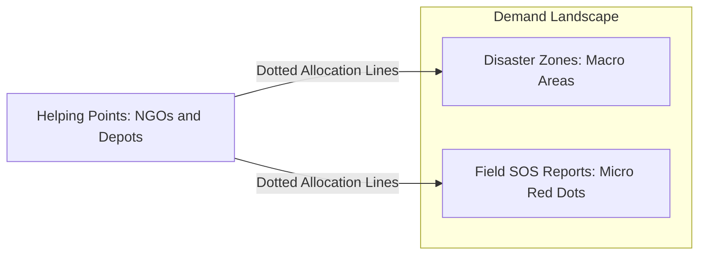
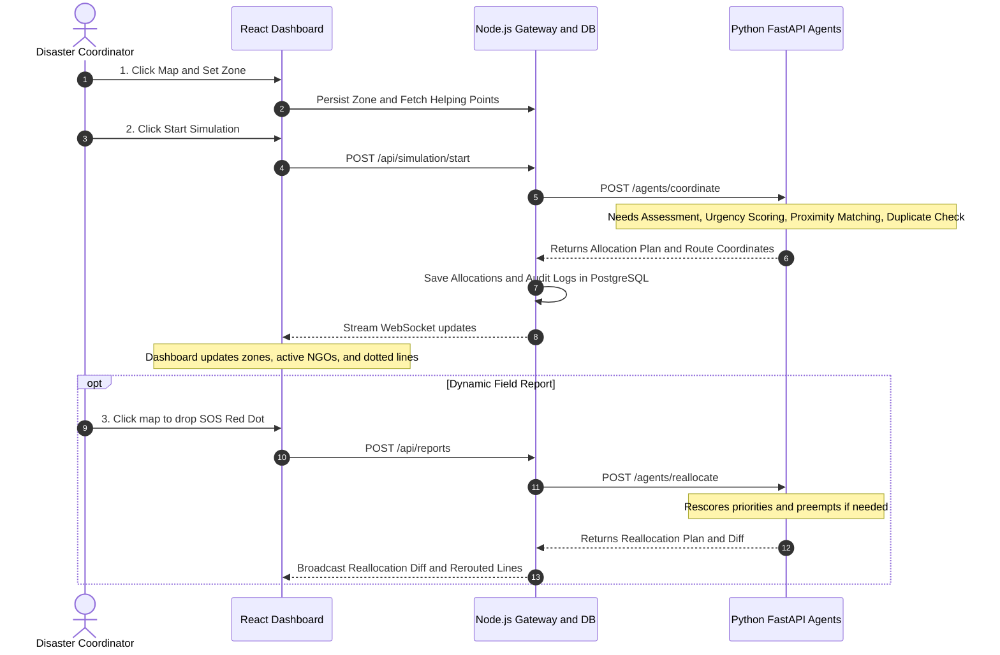

# Product Requirements Document (PRD)
## Project RESQ — Agentic Disaster Relief & Emergency Resource Coordinator

---

## 1. Executive Summary & Vision

**RESQ** is an autonomous multi-agent disaster response coordination platform. It enables disaster managers and relief agencies to simulate, monitor, and coordinate life-saving relief supplies (medical, food, rescue teams, shelter) across disaster-affected zones in real time.

Unlike static emergency maps or manual dispatch boards, RESQ operates on a continuous feedback loop:
1. It automatically allocates resources to affected zones **even in the absence of field reports** based on macro zone properties (radius, population, severity).
2. It ingests **dynamic micro-reports (represented as Red Dots on coordinates)** to triage localized emergencies.
3. It visualizes the entire relief web through **color-coded severity zones, active helping points, and dotted supply trajectory lines**.
4. It catches duplicate inter-agency dispatches and dynamically re-allocates resources when critical events escalate.

---

## 2. Core Concepts & Mental Model

To eliminate confusion between macro areas, individual incidents, and aid providers, the system defines three distinct entities:



1. **Disaster Zones (Macro Demand)**:
   - Drawn on the map with a **center point and radius**.
   - Color-coded by severity: **Red (Critical/High), Orange (Moderate), Yellow (Low)**.
   - Has baseline population and estimated needs. **The system allocates resources to recover these zones even if zero individual field reports have been filed.**
2. **Field Reports (Micro Incidents)**:
   - Ingested via map pin or user report.
   - Rendered as **Red Dots** on the map with exact `(lat, lng)`.
   - Represents an acute crisis (e.g., trapped family, collapsed clinic) that demands instant aid or re-routing.
3. **Helping Points (Supply Nodes)**:
   - Stationary points: NGOs, government warehouses, municipal hospitals, military bases.
   - Positioned by coordinates `(lat, lng)` (no radius).
   - Maintain multi-resource inventory (food, medical kits, shelter kits, rescue teams) and an arrangement capability score.
4. **Dotted Supply Lines (Active Allocations)**:
   - Dynamic visual paths connecting a Helping Point directly to a Zone center or an urgent Red Dot Report.

---

## 3. End-to-End User & Simulation Flow



---

## 4. ML / Multi-Agent Intelligence Engine

When the simulation begins or a new report arrives, the backend packages the current state and triggers the ML agent service.

### 4.1 Input Payload to ML Model (`POST /agents/coordinate`)
The frontend/backend sends the complete scenario snapshot:

```json
{
  "scenario_id": "sim_2026_09_11_01",
  "zones": [
    {
      "zone_id": 1,
      "name": "Riverside Sector 4",
      "center_lat": 18.5204,
      "center_lng": 73.8567,
      "radius_m": 2500,
      "disaster_type": "flood",
      "severity_level": "high",
      "severity_score": 0.85,
      "population_estimate": 12000
    }
  ],
  "reports": [
    {
      "report_id": 101,
      "zone_id": 1,
      "lat": 18.5230,
      "lng": 73.8590,
      "raw_text": "Hospital basement flooded, 40 patients stranded without power",
      "severity_signal": 0.95
    }
  ],
  "helping_points": [
    {
      "point_id": 1,
      "name": "NDRF Base Camp Alpha",
      "type": "govt",
      "lat": 18.5350,
      "lng": 73.8420,
      "reliability_score": 0.95,
      "arrangement_capability": 0.8,
      "inventory": [
        {"resource_id": 1, "resource_name": "rescue_team", "current_stock": 10, "unit": "teams"},
        {"resource_id": 2, "resource_name": "medical", "current_stock": 250, "unit": "kits"},
        {"resource_id": 3, "resource_name": "food", "current_stock": 1500, "unit": "kg"}
      ]
    },
    {
      "point_id": 2,
      "name": "Red Cross Disaster Depot",
      "type": "ngo",
      "lat": 18.5110,
      "lng": 73.8710,
      "reliability_score": 0.90,
      "arrangement_capability": 0.6,
      "inventory": [
        {"resource_id": 2, "resource_name": "medical", "current_stock": 100, "unit": "kits"},
        {"resource_id": 3, "resource_name": "food", "current_stock": 800, "unit": "kg"}
      ]
    }
  ]
}
```

### 4.2 Output Response from ML Model (The Dashboard Contract)
This is the critical response payload that the frontend consumes to render the visual web:

```json
{
  "scenario_id": "sim_2026_09_11_01",
  "status": "success",
  "summary": {
    "total_zones": 1,
    "total_active_helping_points": 2,
    "total_allocated_units": 450,
    "unfulfilled_bottlenecks": 0
  },
  "active_helping_points": [
    {
      "point_id": 1,
      "name": "NDRF Base Camp Alpha",
      "status": "active",
      "lat": 18.5350,
      "lng": 73.8420,
      "committed_resources": [
        {"resource_name": "rescue_team", "quantity": 4},
        {"resource_name": "medical", "quantity": 80}
      ]
    },
    {
      "point_id": 2,
      "name": "Red Cross Disaster Depot",
      "status": "active",
      "lat": 18.5110,
      "lng": 73.8710,
      "committed_resources": [
        {"resource_name": "food", "quantity": 300}
      ]
    }
  ],
  "allocations": [
    {
      "allocation_id": "alloc_001",
      "helping_point_id": 1,
      "helping_point_name": "NDRF Base Camp Alpha",
      "zone_id": 1,
      "zone_name": "Riverside Sector 4",
      "target_type": "report",
      "target_id": 101,
      "target_lat": 18.5230,
      "target_lng": 73.8590,
      "resource_name": "rescue_team",
      "quantity": 4,
      "unit": "teams",
      "status": "en_route",
      "route_coordinates": [
        [18.5350, 73.8420],
        [18.5230, 73.8590]
      ]
    },
    {
      "allocation_id": "alloc_002",
      "helping_point_id": 2,
      "helping_point_name": "Red Cross Disaster Depot",
      "zone_id": 1,
      "zone_name": "Riverside Sector 4",
      "target_type": "zone_center",
      "target_id": 1,
      "target_lat": 18.5204,
      "target_lng": 73.8567,
      "resource_name": "food",
      "quantity": 300,
      "unit": "kg",
      "status": "en_route",
      "route_coordinates": [
        [18.5110, 73.8710],
        [18.5204, 73.8567]
      ]
    }
  ],
  "unfulfilled_demands": [],
  "reasoning_trail": [
    {
      "timestamp": "2026-09-11T14:40:00Z",
      "agent": "PriorityScoringAgent",
      "message": "Zone 1 (Riverside Sector 4) scored urgency 0.88 due to high flood severity and hospital SOS report."
    },
    {
      "timestamp": "2026-09-11T14:40:01Z",
      "agent": "CapacityMatcherAgent",
      "message": "Matched NDRF Alpha (dist: 2.1km) for 4 rescue teams and Red Cross (dist: 2.4km) for 300kg food."
    },
    {
      "timestamp": "2026-09-11T14:40:02Z",
      "agent": "DuplicateDetectionAgent",
      "message": "Verified zero overlapping rescue missions for Report #101. Allocation approved."
    }
  ]
}
```

---

## 5. Database Schema & Storage Clarification

To address where and how data is persisted:

### 5.1 Macro Zones vs Micro Reports
- **`zones` table**: Stores macro regions created by the user (`center_lat`, `center_lng`, `radius_m`, `severity_score`, `disaster_type`).
  - **`zone_needs` table**: Stores aggregate calculated resource demand for that zone. **This ensures the system knows what supplies to send even if 0 reports exist!**
- **`reports` table**: Stores incoming individual SOS reports (`lat`, `lng`, `raw_text`, `severity_signal`, `zone_id`).
  - A report is visually flagged as a **Red Dot** at its exact coordinates.

### 5.2 Allocations & Dotted Lines
- **`allocations` table**:
  - `point_id` (origin Helping Point)
  - `zone_id` (destination macro zone)
  - `report_id` (nullable: if set, destination is the specific Red Dot; if null, destination is the Zone Center)
  - `target_lat`, `target_lng` (explicit target coordinate for immediate UI line rendering)
  - `resource_id`, `quantity`, `status` (`proposed`, `confirmed`, `en_route`, `delivered`, `on_hold`)
  - `hold_reason` (e.g., *"Insufficient stock across all active helping points"*)

### 5.3 Audit Log
- **`audit_log` table**: Records every decision, timestamp, agent name, and plain-English rationale for judge transparency.

---

## 6. Frontend Dashboard Specifications

The React frontend comprises 4 coordinated UI regions:

### 6.1 Interactive Spatial Map (Leaflet / Mapbox)
- **Disaster Zones**:
  - Rendered as semi-transparent circular overlays (`radius_m`).
  - Color-coded border and fill:
    - **High / Critical**: `#EF4444` (Crimson Red)
    - **Moderate**: `#F59E0B` (Amber Orange)
    - **Low / Stabilizing**: `#10B981` (Emerald Green)
- **Helping Points**:
  - Distinct persistent markers (e.g., Hospital icon, NGO badge, Govt depot emblem).
  - Hover tooltip displays current live inventory.
- **Dotted Allocation Lines**:
  - Animated SVG or Leaflet polyline with `dashArray: '5, 10'` connecting `[point.lat, point.lng]` to `[target.lat, target.lng]`.
  - Line color indicates resource type (e.g., Blue for Rescue, Green for Medical, Orange for Food).
- **Incident Reports (Red Dots)**:
  - Pulsing red circular markers at report coordinates. Clicking opens the raw field SOS details.

### 6.2 Simulation Control Panel
- **"Define Zone" Tool**: Click map to set center, drag slider for radius (500m - 5000m), choose disaster type and initial severity.
- **"Start Simulation" Button**: Triggers the initial multi-agent coordination run.
- **"Inject SOS Incident" Button**: Simulates a sudden dynamic field report.

### 6.3 Active Agencies & Inventory Drawer
- List of currently mobilized helping points.
- Depletion gauges showing remaining stock vs maximum capacity.
- Warning badges when a point is near exhaustion.

### 6.4 Real-time Agent Reasoning Stream & Reallocation Diff Banner
- **Diff Banner**: When a dynamic re-allocation occurs, a prominent notification shows the change:
  > 🔄 **Re-allocation Executed:** 2 Rescue Teams re-routed from *Zone 2 (Stable)* -> *Zone 1 Report #101 (Hospital Flooding)*.
- **Agent Feed**: Chronological terminal feed of agent actions.

---

## 7. Next Steps & Technical Milestones

1. **Step 1 (Schema & DB)**: Refine [documentation/disaster_relief_schema.sql](documentation/disaster_relief_schema.sql) with explicit `target_lat`, `target_lng`, and `report_id` fields.
2. **Step 2 (ML Domain Docs & Service)**: Document the agent scoring formulas in `documentation/ml/` and implement the FastAPI agent endpoints in `ml/`.
3. **Step 3 (Backend Orchestration)**: Build the Node.js API endpoints in `backend/` to interface between PostgreSQL, the ML service, and WebSocket clients.
4. **Step 4 (Frontend UI)**: Build the React + Leaflet interactive command center in `frontend/`.
